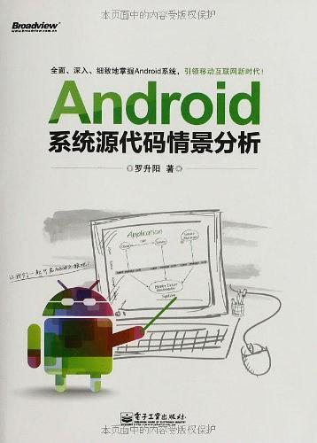
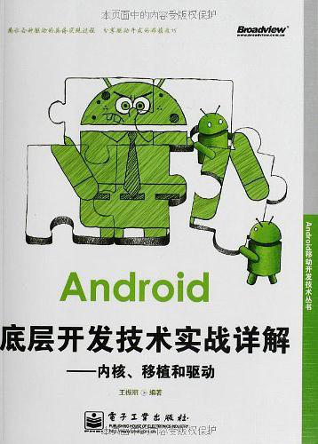

# learn-android


## 本仓库内容

1. android学习

```
Something I hope you know before go into the coding~
First, please watch or star this repo, I'll be more happy if you follow me.
Bug report, questions and discussion are welcome, you can post an issue or pull a request.
```

## 相关站点

* GitBook : <https://yifengyou.gitbooks.io/learn-android/content/>
* GitHub : <https://github.com/yifengyou/learn-android/>
* GitPage : <https://yifengyou.github.io/learn-android/>

## 目录

* [android简介](docs/android简介.md)
    * [android历史](docs/android简介/android历史.md)
    * [android版本](docs/android简介/android版本.md)
* [aosp](docs/aosp.md)
* [android基础](docs/android基础.md)
    * [android架构](docs/android基础/android架构.md)
    * [android的本质](docs/android基础/android的本质.md)
* [android衍生系统](docs/android衍生系统.md)
    * [cyanogenmod](docs/android衍生系统/cyanogenmod.md)
    * [lineageos](docs/android衍生系统/lineageos.md)
    * [mokee](docs/android衍生系统/mokee.md)
* [android编译工具链](docs/android编译工具链.md)
    * [GNU GCC](docs/android编译工具链/GNUGCC.md)
    * [Linaro](docs/android编译工具链/Linaro.md)
    * [Saberod](docs/android编译工具链/Saberod.md)
    * [UberTC](docs/android编译工具链/UberTC.md)
* [机型适配](docs/机型适配.md)
    * [小米5s xiaomi5s capricorn](docs/机型适配/小米5s.md)
        * [型号配置](docs/机型适配/小米5s/型号配置.md)
        * [源码](docs/机型适配/小米5s/源码.md)
        * [工具链](docs/机型适配/小米5s/工具链.md)
        * [编译](docs/机型适配/小米5s/编译.md)
        * [刷机](docs/机型适配/小米5s/刷机.md)
    * [小米9 xiaomi9 cepheus](docs/机型适配/小米9.md)
        * [型号配置](docs/机型适配/小米9/型号配置.md)
        * [源码](docs/机型适配/小米9/源码.md)
        * [工具链](docs/机型适配/小米9/工具链.md)
        * [编译](docs/机型适配/小米9/编译.md)
        * [刷机](docs/机型适配/小米9/刷机.md)


## 参考书籍



在内容上，本书结合使用情景，全面、深入、细致地分析Android系统的源代码，涉及到Linux内核层、
硬件抽象层（HAL）、运行时库层(Runtime)、应用程序框架层(Application Framework)以及应用程序层(Application)。

在组织上，本书将上述内容划分为初识Android系统、Android专用驱动系统和Android应用程序框架三大篇章。
初识Android系统篇介绍了参考书籍、基础知识以及实验环境搭建；Android专用驱动系统篇介绍了Logger日志驱动程序、
Binder进程间通信驱动程序以及Ashmem匿名共享内存驱动程序；Android应用程序框架篇从组件、进程、
消息以及安装四个维度来对Android应用程序的框架进行了深入的剖析。

通过上述内容及其组织，本书能使读者既能从整体上把握Android系统的层次结构，又能从细节上去掌握每一个层次的要点。



Android底层开发技术实战详解：内核、移植和驱动
