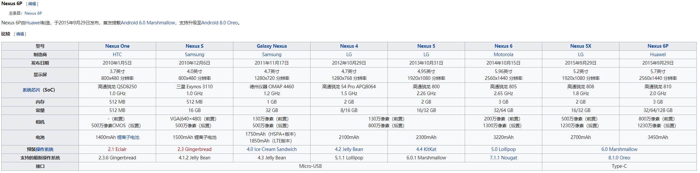

# Nexus 6P

## 简介

**谷歌亲儿子 Nexus系列**

Google Nexus是一个使用Android操作系统的消费电子产品系列，由Google设计、开发、销售并提供支持，并由与Google合作的原始设备制造商制造并进行部分的开发。截至2015年11月，最新款Nexus系列设备为Nexus 6P手机（华为制造）、Nexus 5X手机（LG制造）、Nexus 9平板电脑（HTC制造）以及Nexus Player媒体播放器（华硕制造）。

2016年，Google 宣布以Google Pixel 品牌取代Nexus，Nexus品牌正式走入历史。

Nexus系列设备被认为是Google的“旗舰级”Android产品。所有Nexus设备皆使用可解锁的引导程序[6]以便进行进一步开发及允许终端用户对系统程序做出修改。在Google Pixel发布前，Nexus设备通常是首批收到操作系统更新的Android设备。

