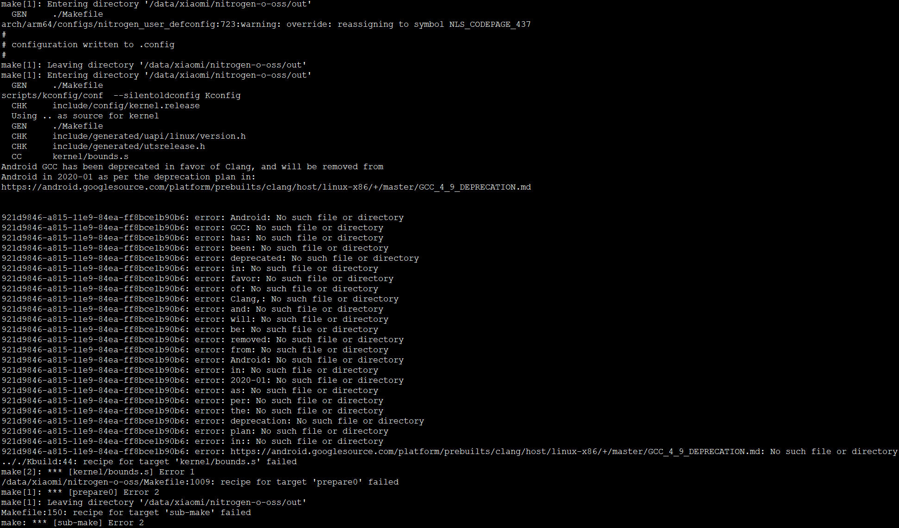

# 编译内核

## 参考

* <https://github.com/MiCode/Xiaomi_Kernel_OpenSource/wiki/How-to-compile-kernel-standalone>
* <https://github.com/MiCode/Xiaomi_Kernel_OpenSource/issues/957>

如果你只是想编译内核并刷入, 不用按照wiki步骤去下载几百G的东西, 只需要下载小米开源的这部分内核源码就已经足够让你编译一个可以自定义并刷入自己的ROM的内核. 按照下面的步骤来执行. 这里以我的手机 mi max3, 编译环境 ubuntu 16.04 为例:

## 安装开发环境相关包

```
sudo apt install -y bc bison build-essential ccache curl flex g++-multilib gcc-multilib git gnupg gperf imagemagick lib32ncurses5-dev lib32readline-dev lib32z1-dev liblz4-tool libncurses5-dev libsdl1.2-dev libssl-dev libwxgtk3.0-dev libxml2 libxml2-utils lzop pngcrush rsync schedtool squashfs-tools xsltproc zip zlib1g-dev unzip openjdk-8-jdk language-pack-zh-hans
```

## checkout 内核源码
```
git clone --depth=1 https://github.com/MiCode/Xiaomi_Kernel_OpenSource -b nitrogen-o-oss
```

## 下载跨平台编译链工具

```
git clone --depth=1 https://android.googlesource.com/platform/prebuilts/gcc/linux-x86/aarch64/aarch64-linux-android-4.9
```

## 编译前的环境变量配置

```
export ARCH=arm64
export SUBARCH=arm64
export CROSS_COMPILE=/data/xiaomi/aarch64-linux-android-4.9/bin/aarch64-linux-android-
```

这里有两点要注意的:
1. CROSS_COMPILE 这里的路径请记得修改为你自己的路径
2. CROSS_COMPILE 的路径最后有一个 - , 至于为什么, 看一下这个路径下的二进制文件的名字规则, 和Makefile是怎么写的就明白了

查找并确定 defconf 文件, 这个文件的路径一般在内核源码的 arch/arm64/configs 目录下, 会有一大堆的 defconf 文件, 找到最适配你的机型的 defconf 文件, 我这里是 nitrogen_user_defconfig

## 进入内核源码的根目录并开始编译

```
make O=out nitrogen_user_defconfig
make O=out -j8
```

这里要注意

1. O=out 不能省略, 否则会出现类似 include 尖角括号找不到头文件 这种问题 #OnePlusOSS/android_kernel_oneplus_msm8998#3 一般来说小米代码开源前都已经走过流程, 是可以正常编译成功的
2. 编译 success 后, 会在 out/arch/arm64/boot 目录下生成 Image.gz-dtb 文件, 这就是编译出来的内核文件

使用AnyKernel2 #https://github.com/osm0sis/AnyKernel2 , 按照说明替换你的Image.gz-dtb 文件并编辑 anykernel.sh 文件. 里面的参数非常非常非常简单, 按照自己的实际需求编辑一下里面的参数并打包成zip文件. 或者更简单的, 你找一个你的设备的第三方内核zip包, 建议在不解压的情况下直接删除zip包里面的 Image.gz-dtb 并替换成你的 Image.gz-dtb 文件即可.

进入twrp, 刷入这个zip文件, 开机. 如果出问题, anykernel.sh里面可以配置日志的路径, 你可以查看日志相关的信息.

如果你想将其打包成 boot.img 文件, 上小米官网下载手机对应的官方线刷包, 解压出来在images目录下有 boot.img, 使用 unpackbootimg 工具将这个img解开, 把你的Image.gz-dtb替换进去并用 mkbootimg 重新打包成 boot.img 即可.

注意, 刷入后你的 WIFI 可能不能正常工作, 原因和解决方案在这里: https://github.com/MiCode/Xiaomi_Kernel_OpenSource/wiki/FAQ


## 编译问题



* 奇了怪了。华为服务器编译通过，但是物理机编译无法通过，同样的代码啊。。我做错了什么？
* 这个编译器已经退休，在网上找了个克隆版的


<https://github.com/LineageOS/android_prebuilts_gcc_linux-x86_aarch64_aarch64-linux-android-4.9>


---
