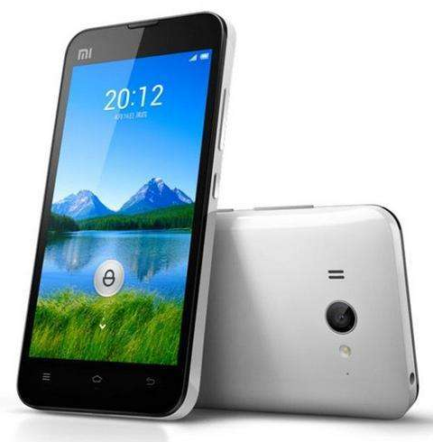
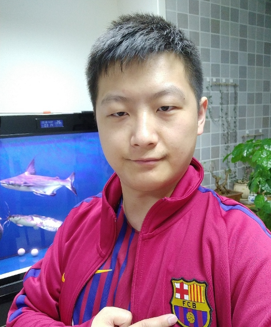

<!-- TOC depthFrom:1 depthTo:6 withLinks:1 updateOnSave:1 orderedList:0 -->

- [aries-mokee刷机玩耍指南](#aries-mokee刷机玩耍指南)
	- [小米2手机简介](#小米2手机简介)
		- [配置参数](#配置参数)
		- [性能](#性能)
		- [开源](#开源)
	- [魔趣Mokee简介](#魔趣mokee简介)
		- [魔趣官方网址](#魔趣官方网址)
	- [Mokee安卓定制系统编译](#mokee安卓定制系统编译)
	- [刷机](#刷机)
	- [总结](#总结)

<!-- /TOC -->
# aries-mokee刷机玩耍指南

## 小米2手机简介

小米手机2于2012年8月16日在北京798艺术中心正式发布；小米手机2采用4.3英寸342超高PPI 触摸屏，处理器采用28纳米四核处理器，配备2GB RAM和16GB机身内存，新一代背照式800万像素主摄像头，200万像素前置摄像头，硬件配置震撼。在系统方面，小米手机2采用基于Android 4.1 版本的MIUI 4.0 操作系统。由于小米手机2采用基于Krait微架构的高通S4处理器，相比A9架构的芯片，这款处理器性能更强，功耗更低。

### 配置参数

### 性能

2GB超大运行内存、4.3英吋1280x720 IPS超高PPI高清视网膜屏幕、第二代背照式800万像素背照式CMOS摄像头、堪比XBOX游戏机的GPU显示等硬件配置让其成为当前全球性能最强大的手机。

小米手机2是全球首款采用高通APQ 8064四核1.5GHz处理器的智能手机，这款CPU采用28纳米Krait架构，拥有双通道内存，带来极致流畅的操作体验。在规格上已经压倒了三星猎户座四核、NVIDIA Tegra 3等市售四核移动处理器。

小米手机2采用4.3英寸IPS超高PPI精度视网膜屏，分辨率高达1280 x 720，显示精度342PPI，超越iPhone 4S。

小米手机2采用全新一代背照式800万像素CMOS摄像头，F/2.0大光圈，27mm超大广角，内含五组镜片，配合蓝玻璃红外滤光片，减少杂光偏色，成像效果更加纯净真实！

采用智能双天线设计，当手机处于通话、传输数据等状态时，系统将自动判断并切换至信号最佳的天线，保障信号接收，带来更稳定的通话质量与数据传输速度。

小米手机2采用基于Android 4.1深度开发MIUI（米柚）V4 操作系统。米柚V4针对中国用户使用习惯进行上百项优化改进，拥有更好的用户体验、更流畅的软件运行和更稳定的操作基础。此外，MIUI（米柚）V4提供了近万套的桌面主题下载，百变锁屏让智能手机避免了“千机一面”。

### 开源

<https://github.com/MiCode/mi2_kernel/>

## 魔趣Mokee简介

Mokee（魔趣），全称MoKee OpenSource，项目发起于2012年12月12日 。魔趣由马丁龙猪创建，是国内最大的非营利性开源ROM。早期基于CM，现在基于AOSP。

GitHub上，因为是开源项目的关系，所以ROM的安全性比其他第三方系统更有保障。

每天更新每夜版，支持增量更新，还不定时加入方便国人的小功能，因此受到不少用户的青睐，目前支持机型已达上百款，支持安卓2.3-7.1的部分设备。

MoKee OpenSource是基于Google AOSP源码开发的一个Android分支，同时也是国内首个完整开源的Android项目，使用者和开发者遍布海内外。

魔趣论坛由martincz（马丁龙猪）在2009年7月17日发起并建立，是国内最大的非营利性民间玩家论坛，前身为ITFUNZ摩托罗拉手机论坛。

马丁猪笼微博<https://weibo.com/martincz>

大佬靓照

### 魔趣官方网址

官方网址：<http://www.mokeedev.com/>

## Mokee安卓定制系统编译

## 刷机

## 总结
